This project contains below mentioned sections:
- Introduction
- Background
- Tools used
- Analysis
- Conclusion

🗺️ 🛠️

# Introduction

#### 📊 Sales and Profit Data Analysis Project

This project is a detailed analysis of retail sales data aimed at uncovering key insights to drive business improvement. By exploring sales trends, customer behavior, shipping modes, and profitability across various segments, the project seeks to provide actionable recommendations for boosting sales, improving customer retention, and optimizing operational efficiency. The insights gained from this analysis help drive data-backed decision-making for enhancing business performance.

#### 🔍 Key Objectives
The primary objectives of this project are:
- To analyze sales and profit performance across different customer segments and regions.
- To identify top customers and most profitable products.
- To assess the effectiveness of shipping methods and their impact on profit.
- To evaluate discount strategies and their influence on sales.
- To suggest strategies for increasing profitability while enhancing customer satisfaction and retention.

🔗 Check the SQL queries here: 📂[Sales_Data_Analyis](Sql_queries)

# Background


The dataset used in this project comes from a retail store’s sales records, spanning several years. It contains comprehensive details on orders, products, customers, sales, profits, discounts, and shipping. The dataset includes fields such as sales, profit, discount, shipping mode, customer segment, and regional information, providing a comprehensive view of the store's operations over time.

📊 ***Data Source:*** The dataset can be accessed on Kaggle through the following [link.](https://www.kaggle.com/datasets/vivek468/superstore-dataset-final?resource=download) 

The project's objective is to analyze this data to uncover actionable insights that can drive business growth and enhance operational performance.

### Key Analyses Performed
This project focuses on answering the following key business questions:

1.  📊 [Sales and Profit Analysis](#sales-and-profit-analysis): Which customer segments, products, and regions drive the highest sales and profit?  How can we maximize sales and profit performance?
1. 💼 [Product Performance](#product-performance): What are the most profitable products, and how do different categories perform in terms of sales volume and profit margins?
1. 💰 [Discount Impact](#discount-impact): What impact do discount strategies have on sales and profitability across various segments and regions? How can discounting be optimized to boost profit without compromising too much on revenue?
1. 💡  [Shipping Mode Analysis](#shipping-mode-analysis): What shipping modes are the most efficient and profitable? How do different shipping modes perform in terms of order volume, total profit, and customer preference across regions and segments?
1. 📊 [Customer Segmentation and Retention](#customer-segmentation-and-retention): Who are the top customers in terms of profit and order volume? How can customer loyalty and retention be improved by focusing on high-value customers?

# Tools Used
- SQL: Executed SQL queries to analyze the dataset.
- PostgreSQL: Managed the database where the dataset was stored.
- Visual Studio Code: Wrote and edited SQL queries and project files.
- Git and GitHub: Version control system used to track changes in project files and hosted the project repository and facilitated collaboration and sharing.

# Analysis 

## Sales and Profit Analysis
<a name="sales-and-profit-analysis"></a> 


1. **Analyzing the year wise total sales and profit**

```sql

with summary as (
select 
    extract (year from order_date) as year, 
    cast(sum(sales) as decimal(10,1)) as total_sales, 
    cast (sum(profit) as decimal (10,1)) as total_profit
from superstore
group by year
order by year asc
)
select *, 
     cast (((total_sales * 1 / lag(total_sales) over (order by year)) - 1) * 100 as decimal (10,1)) as sales_increase,
     cast (((total_profit * 1 / lag(total_profit) over (order by year)) - 1) * 100 as decimal (10,1)) as profit_increase
from summary;
```

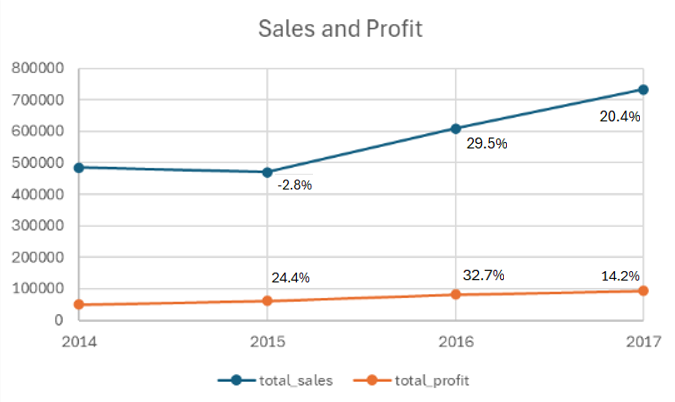

####  📊 Key Insights:

- The year-wise sales and profit data reveals a steady upward trend overall, with a slight dip in sales in 2015. Despite this, profit still grew in 2015, suggesting effective cost management. 
- Significant growth in both sales (29.5%) and profit (32.7%) in 2016 indicates a year of strong performance, likely driven by strategic decisions or market conditions. 
-  The momentum continued in 2017 with both sales and profits increasing, although at a slower pace compared to 2016. Optimizing strategies during periods of slower growth could help sustain long-term profitability and sales increases.

<br/>

 2. **Analyzing Quarter wise total sales and profit**

```sql
with summary as (
select 
    extract (quarter from order_date) as quarter, 
    cast(sum(sales) as decimal(10,1)) as total_sales,
    cast (sum(profit) as decimal (10,1)) as total_profit
from superstore
group by quarter
order by quarter asc
)
select *, 
     cast (((total_sales * 1 / lag(total_sales) over (order by quarter)) - 1) * 100 as decimal (10,1)) as sales_increase,
     cast (((total_profit * 1 / lag(total_profit) over (order by quarter)) - 1) * 100 as decimal (10,1)) as profit_increase
from summary;
```

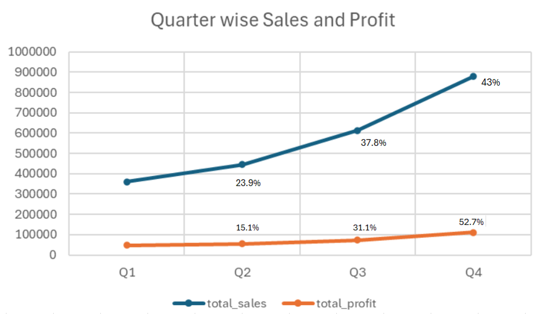


####  📊 Key Insights:

The data reveals a consistent increase in sales and profit throughout the quarters, with Q4 showing the highest performance. Sales surged by 43% and profits by 52.7% in Q4, which suggests strong seasonal effects or effective end-of-year strategies. Q3 also demonstrated significant growth, indicating a robust period, while Q1 lagged behind with the lowest figures.
 
  To optimize sales performance year-round, consider enhancing Q1 results through targeted promotions or introducing new products early in the year to build momentum.

<br/>

3. **Analyzing segment wise total sales and profit**

```sql
select 
    segment, 
    cast(sum(sales) as decimal(10,1)) as total_sales, 
    cast (sum(profit) as decimal (10,1)) as total_profit,
    cast((sum(Profit)/sum(Sales)) *100 as decimal(10,0)) AS profit_margin_percentage
from superstore
group by segment
order by total_sales;
```

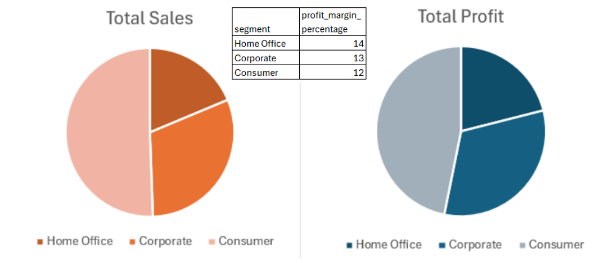

####  📊 Key Insights:

The Consumer segment leads with the highest sales and profit, despite having the lowest profit margin of 12%. The Corporate segment shows strong sales and a decent profit margin of 13%, while the Home Office segment, though having the smallest sales, exhibits a slightly higher profit margin of 14%. 

To boost overall profitability, consider strategies to enhance the profit margins in the Consumer segment and leverage the higher margin in the Home Office segment for growth.

<br/>

4. **Analyzing region wise total sales and profit**

```sql
select 
    region, 
    cast(sum(sales) as decimal(10,1)) as total_sales, 
    cast (sum(profit) as decimal (10,1)) as total_profit
from superstore
group by region
order by total_sales desc;
```

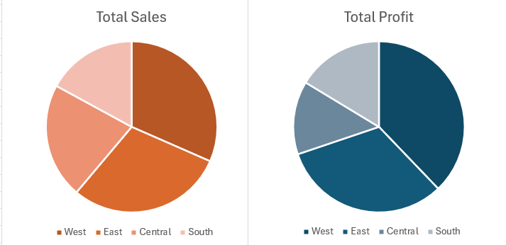

####  📊 Key Insights:

Top-Performing Regions: The West region outperforms others with the highest total sales and profit, indicating a strong market presence and potentially effective sales strategies. The East region also shows robust performance, though it lags behind the West. The Central and South regions have lower sales and profit, with the South showing the lowest figures

Opportunity for Expansion: Focus on enhancing market strategies in the Central and South regions. Leveraging successful tactics from the top-performing West region could help increase sales and profitability in these areas.

<br/>

5. **Analyzing category wise total sales and profit**


```sql
select 
    category, 
    cast(sum(sales) as decimal(10,1)) as total_sales, 
    cast (sum(profit) as decimal (10,1)) as total_profit,
    cast((sum(Profit)/sum(Sales)) *100 as decimal(10,0)) AS profit_margin_percentage
from superstore
group by category
order by total_sales desc;
```

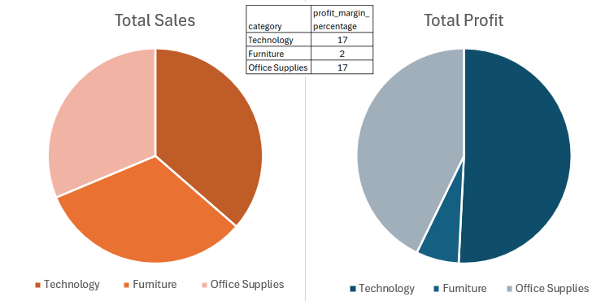

####  📊 Key Insights:

The data reveals that the Technology and Office Supplies categories are the most profitable, each achieving high profit margins, with Technology standing out for its exceptional performance. 

In contrast, the Furniture category, despite generating substantial sales, has a significantly lower profit margin. This suggests a need for strategic improvements in pricing or cost management within the Furniture category to enhance overall profitability.

<br/>

6. **Analyzing sub-category wise total sales and profit**

```sql
select 
    sub_category, 
    cast(sum(sales) as decimal(10,1)) as total_sales, 
    cast (sum(profit) as decimal (10,1)) as total_profit,
    cast((sum(Profit)/sum(Sales)) *100 as decimal(10,0)) AS profit_margin_percentage
from superstore
group by Sub_category
order by profit_margin_percentage desc;
```

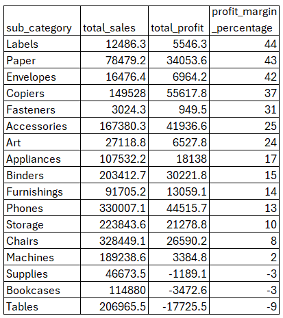
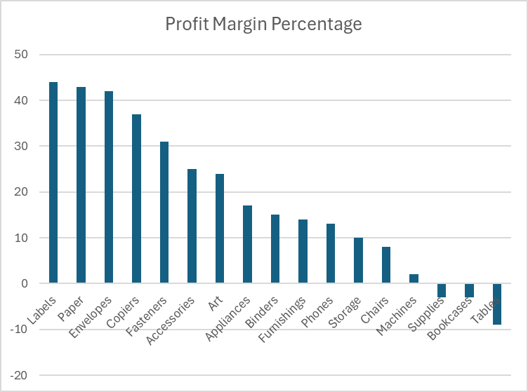


####  📊 Key Insights:

The sub-category analysis shows significant variation in profitability. Labels, Paper, and Envelopes are the top performers with high profit margins, indicating strong profitability and efficient cost management. 

On the other hand, Supplies, Bookcases, and Tables are struggling with negative profit margins, suggesting issues with either pricing or cost structure.Addressing these issues, possibly through price adjustments or cost reductions, could improve profitability in these less successful sub-categories. Additionally, focusing on leveraging the high-margin sub-categories could help boost overall profit margins.

</br>

## Product Performance
<a name="product-performance"></a> 


1. **Determining the Best-Selling Products**

```sql
select product_name,
    cast (sum(quantity) as decimal (10,1)) as quantity_sold,
    cast(sum(sales) as decimal(10,1)) as total_sales, 
    cast (sum(profit) as decimal (10,1)) as total_profit
from superstore
group by product_name
order by quantity_sold desc;
```

####  📊 Key Insights:

The analysis reveals that products like "Easy-staple paper" and "Staple envelope" have high sales and profits, indicating strong market demand. However, products such as "KI Adjustable-Height Table" have high sales but negative profit margins, suggesting pricing or cost issues.  Additionally, Products such as "Xerox 1984" and "Grip Seal Envelopes" have very low sales volumes, suggesting limited market appeal or niche usage.

<br/>

2. **Analysing the least profit margin products**

```sql
select product_name,
    cast(sum(sales) as decimal(10,1)) as total_sales, 
    cast (sum(profit) as decimal (10,1)) as total_profit,
    cast((sum(Profit)/sum(Sales)) *100 as decimal(10,0)) AS profit_margin_percentage
from superstore
group by product_name
order by profit_margin_percentage asc
limit 20;
```
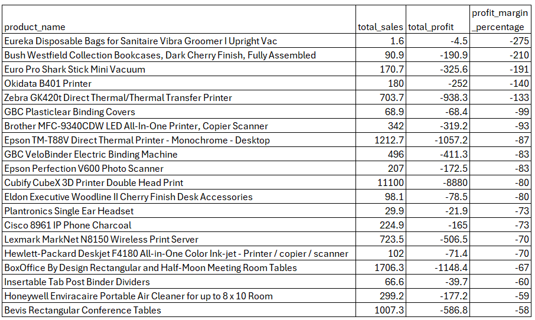

####  📊 Key Insights:

Several products, such as the "Eureka Disposable Bags" and "Bush Westfield Collection Bookcases," are experiencing extremely negative profit margins, leading to substantial financial losses. Items like the "Euro Pro Shark Stick Mini Vacuum" and "Zebra GK420t Printer" also reflect consistently poor profitability, suggesting ongoing issues with these products. 

To address these challenges, it’s crucial to re-evaluate pricing strategies, reduce production or procurement costs, and explore potential improvements in product quality. In some cases, discontinuing these unprofitable items might be a necessary step to prevent further losses.

<br/>

3. **Identifying low performing products**

```sql
select product_name,
    cast(sum(sales) as decimal(10,1)) as total_sales, 
    cast (sum(profit) as decimal (10,1)) as total_profit
from superstore
group by product_name
having 
    sum(sales) < 100
    and sum(profit)<100
order by total_profit asc
limit 10;
```

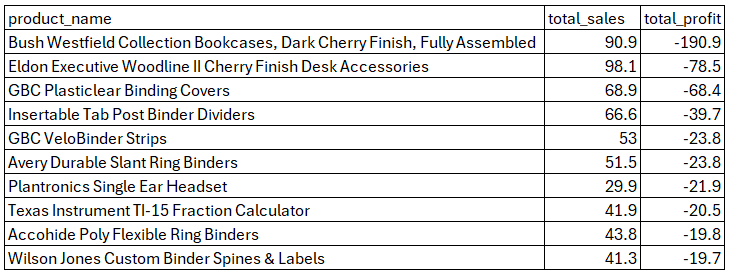

####  📊 Key Insights:

The data highlights a critical issue with several products that are underperforming, showing both low sales and negative profits. They are not only failing to generate adequate revenue but are also contributing to losses. Immediate action is needed to address these products to prevent further financial losses. Strategies should include reassessing pricing strategies, improving product quality or features, and ramping up marketing efforts. 

Additionally, conducting market research and gathering customer feedback will be crucial to understand the root causes of these issues and to devise effective solutions.

</br>

## Discount Impact
<a name="discount-impact"></a> 


1. **Analyzing Discount Impact on Sales and Profitability**

```sql
select 
    discount,
    sum((sales/(1-discount))-sales) as sum_discount,
    cast (sum(quantity) as decimal (10,1)) as quantity_sold,
    cast(avg(sales) as decimal(10,1)) as avg_sales, 
    cast(sum(sales) as decimal(10,1)) as total_sales, 
    cast (sum(profit) as decimal (10,1)) as total_profit,
    cast((sum(Profit)/sum(Sales)) *100 as decimal(10,0)) AS profit_margin_percentage
from superstore
group by discount
order by discount desc
```
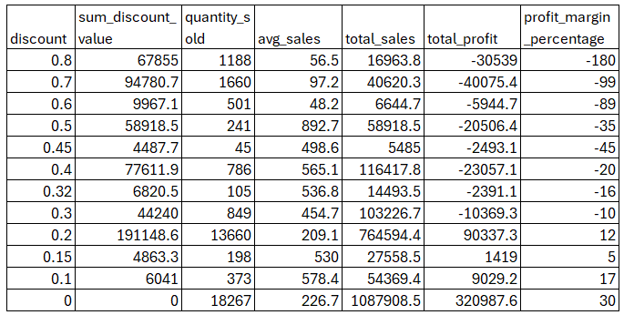

####  📊 Key Insights:

- High Discounts and Losses: Discounts of 0.8 to 0.6 drive large sales volumes but lead to severe losses, with profit margins ranging from -180% to -89%. These deep discounts are unsustainable and heavily erode profitability, indicating the need to reassess their effectiveness.
- Moderate Discounts and Balanced Margins: Discounts from 0.5 to 0.3 offer a better balance between sales and profitability. While profit margins remain negative, the losses are less extreme, suggesting this range could be optimized for better results.
- Low Discounts and Profitability: Discounts of 0.2 and below yield positive profit margins (12%-17%), proving more sustainable. These discounts attract fewer sales but generate higher profits, offering a strategic approach to retaining customers while boosting profitability.

A tiered discount strategy, using lower discounts for profitability and higher ones selectively, can balance volume and profit while maintaining customer satisfaction.

<br/>

2. **Discount analysis broken down by quarter,region and category**

```sql
select 
    extract(quarter from order_date) as quarter,
    cast(avg(discount) as decimal (10,1)) as avg_discount,
    cast(sum((sales/(1-discount))-sales) as decimal (10,1)) as sum_discount_value,
    cast(sum(quantity) as decimal (10,1)) as quantity_sold,
    cast((sum(Profit)/sum(Sales)) *100 as decimal(10,0)) AS profit_margin_percentage
from superstore
group by quarter
order by quarter asc
```
##### **same query was used for region and category wise analysis*

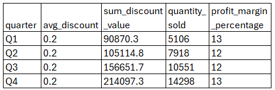
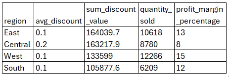
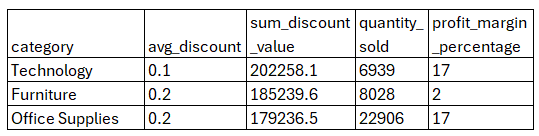
####  📊 Key Insights:

* Quarterly Discount Patterns:
Discounts tend to increase throughout the year, with Q4 having the highest average discount at 15.6%. This is correlated with the highest total discount amount in Q4 ($214,097.28) and the highest total sales. Despite the increase in discount, profit margins remain relatively stable, ranging from 12% to 13% across the quarters.
* Regional Discount Trends:
Central Region has the highest average discount at 24%, leading to significant total discounts but with a lower profit margin of 8%. West Region maintains the lowest average discount at around 11%, resulting in the highest profit margin of 15%. East and South regions have average discounts of 14.5% and 14.7%, respectively, with profit margins of 13% and 12%.
* Category-Specific Discount Analysis:
Furniture has the highest average discount at 17.4%, which results in the lowest profit margin of just 2%. Office Supplies and Technology have average discounts of 15.7% and 13.2%, respectively, with higher profit margins of 17% for both. The high discount on Furniture appears to significantly impact its profitability compared to other categories.

</br>

## Shipping Mode Analysis
<a name="shipping-mode-analysis"></a> 


1. **Overall Shipping mode preferences**

```sql
select ship_mode,
    count(order_id) as order_count,
    cast(sum(sales) as decimal(10,1)) as total_sales, 
    cast (sum(profit) as decimal (10,1)) as total_profit,
    cast((sum(Profit)/sum(Sales)) *100 as decimal(10,0)) AS profit_margin_percentage,
    cast(avg(ship_Date- Order_date)as decimal(10,1)) as shipping_days
from superstore
group by ship_mode
order by count(order_id) desc;
```

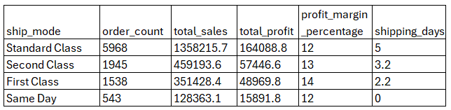

####  📊 Key Insights:

- Standard Class: Most orders are shipped this way, generating the highest sales and profit. It has a moderate shipping time of 5 days and a profit margin of 12%.
- Second Class: This method handles fewer orders than Standard but still shows strong performance with a slightly better profit margin of 13%. It ships faster than Standard Class, with an average of 3.2 days.
- First Class: Known for its high profit margin (14%) and the fastest shipping time (2.2 days), it has fewer orders and generates less total sales and profit compared to Standard and Second Class.
- Same Day: This method has the fastest shipping (0 days) but results in the lowest sales and profit. It matches Standard Class’s profit margin of 12%.

Each shipping mode offers different advantages in terms of speed, sales, and profitability.

<br/>

2. **Shipping days vs profitability**

```sql
select ship_mode,
    cast((ship_Date- Order_date)as decimal(10,1)) as shipping_days,
    count(order_id) as order_count, 
    cast (avg(profit) as decimal (10,1)) as avg_profit
from superstore
group by ship_mode,shipping_days
order by ship_mode, shipping_days;
```

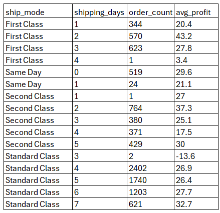

####  📊 Key Insights:

- Shorter Shipping Days (Same Day, 1 Day): Same Day shipping shows a consistent profit with relatively few orders, but higher profits are seen for a shorter average shipping time. First Class has a similar trend with higher average profits for shorter shipping times (1-2 days).
- Medium Shipping Days (3-5 Days): For Second Class, profitability is relatively stable with moderate shipping days, peaking at around 5 days. Standard Class also maintains decent profitability across shipping days of 3-7, with some fluctuations.
- Longer Shipping Days: Longer shipping days (4-7 days) generally show stable to improved profitability for Standard Class, while First Class has a sharp drop in profit for orders with a 4-day shipping time.

<br/>

3. **Segment-wise Shipping Mode Preferences and Profitability**

```sql
select segment, ship_mode,
    count(order_id) as order_count, 
    cast (sum(profit) as decimal (10,1)) as total_profit
from superstore
group by segment, ship_mode
order by segment,avg(ship_Date- Order_date);
```
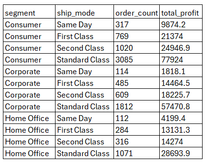

####  📊 Key Insights:

- Consumer Segment: Prefers Standard Class and Second Class for their cost-effectiveness and reliability. While Same Day and First Class are less popular, they still contribute to profitability with First Class performing better than Same Day.
- Corporate Segment: Shows a similar preference for Standard Class and Second Class. The higher total profit from Standard Class indicates that corporate clients value its balance of cost and delivery speed. Same Day and First Class are less utilized in this segment, indicating that businesses prefer more cost-effective options.
- Home Office Segment: Aligns with the overall trend of favoring Standard Class for its profitability and order volume. Second Class also performs well, but Same Day and First Class have a smaller impact, suggesting that Home Office customers value cost-efficiency and are less focused on rapid delivery.

</br>

## Customer Segmentation and Retention

<a name="customer-segmentation-and-retention"></a> 

```sql
select count(DISTINCT(customer_id)) from superstore;
```
*We got 793 unique customers in the dataset*

</br>

1. **Top 10 Customers Driving Highest Profit**

```sql
select customer_id,
    cast(sum(sales) as decimal(10,1)) as total_sales, 
    cast (sum(profit) as decimal (10,1)) as total_profit
from superstore
group by customer_id
order by total_profit desc
limit 10;
```
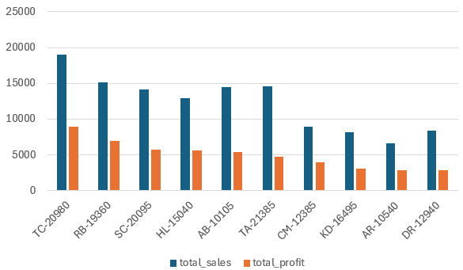

####  📊 Key Insights:

Above are the top 10 customers which drive the maximum profit for the store, with TC-20980 leading at $8,981.3. These customers are crucial for the store's profitability, highlighting their significant impact on overall financial performance.

</br>

2. **Top 10 Customers by Highest Average Order Value**

```sql
select customer_id,
    cast(avg(sales) as decimal(10,1)) as avg_sales
from superstore
group by customer_id
order by avg_sales desc
limit 10;
```

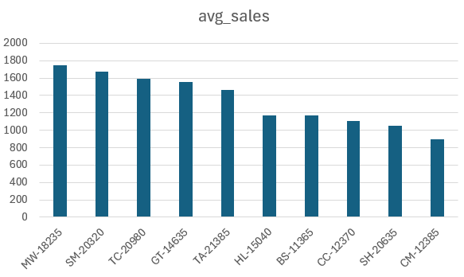

####  📊 Key Insights:

The top 10 customers with the highest average order values are led by MW-18235, with an average of $1,751.3. These customers demonstrate the highest spending per transaction, indicating a significant contribution to overall revenue through larger individual purchases. Their high average order values reflect their strong purchasing power and the potential for targeting high-value sales strategies.

</br>

2. **identifying customers by segment**

```sql
select segment, count(distinct(customer_id)) as distinct_customer,
    cast (sum(quantity) as decimal (10,1)) as quantity_sold,
    cast(sum(sales) as decimal(10,1)) as total_sales, 
    cast (sum(profit) as decimal (10,1)) as total_profit
from superstore
group by segment
order by total_profit desc;
```
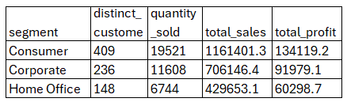

####  📊 Key Insights:

- Consumer Segment: The largest segment with 409 unique customers, generating the highest total profit of $134,119.2. They account for the highest quantity sold and total sales, indicating strong overall performance and profitability.
- Corporate Segment: Comprising 236 customers, this segment shows substantial profitability with a total of $91,979.1, despite fewer customers and lower total sales compared to the Consumer segment. It still contributes significantly to revenue.
- Home Office Segment: With 148 customers, this segment has the lowest total sales and profit but remains a significant part of the business with a total profit of $60,298.7. The lower numbers suggest a more niche market compared to Consumers and Corporates.


</br>

3. **Identifying customers by region and state**

```sql
select region, state, 
    count(distinct(customer_id)) as distinct_customer,
    cast (sum(quantity) as decimal (10,1)) as quantity_sold,
    cast(sum(sales) as decimal(10,1)) as total_sales, 
    cast (sum(profit) as decimal (10,1)) as total_profit
from superstore
group by region, state
order by distinct_customer desc
limit 10;
```
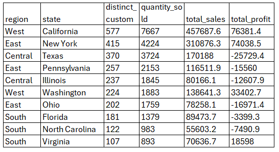

####  📊 Key Insights:

- West Region: Dominates in customer numbers with a strong presence in California (577 customers) and Washington (224 customers). This suggests a high customer base and potential market strength in this region.
- East Region: Also shows substantial customer numbers, especially in New York (415 customers) and Pennsylvania (257 customers). Despite having fewer top customers compared to the West, it maintains significant market coverage.
- Central Region: Has notable customer counts with Texas (370 customers) and Illinois (237 customers). However, the Central region also shows some negative profitability, indicating potential issues in customer satisfaction or cost management.
- South Region: Includes several states like Florida (181 customers), North Carolina (122 customers), and Virginia (107 customers). While the South has fewer top customers compared to other regions, Virginia stands out with a positive profit despite a smaller customer base.


</br>

4. **Total orders per customer**

```sql
select distinct(customer_id),
    count(DISTINCT(order_id)) as order_count,
    sum(quantity) as total_quantity
from superstore
group by customer_id
having count(DISTINCT(order_id))>1
order by count(DISTINCT(order_id)) desc
limit 10;
```

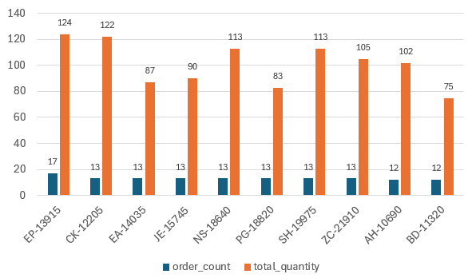

####  📊 Key Insights:

These are the top 10 customers who place the highest number of orders, indicating strong engagement and loyalty. They are key to maintaining a steady flow of business and should be prioritized for retention strategies. Rewarding their loyalty with incentives or exclusive offers could enhance their satisfaction and further solidify their commitment.
</br>


# Conclusion


***Sales and Profit Analysis***

* Yearly and Quarterly Trends: Sales and profits have shown steady growth overall, with notable peaks in Q4 and significant annual increases from 2014 to 2017. However, growth rates varied, with Q4 and the final year showing the highest performance. Emphasizing Q1 improvements and managing seasonal fluctuations could balance sales more evenly throughout the year.

* Segment and Regional Performance: The Consumer segment and the West region lead in total sales and profit, while the South segment and Central region lag behind. Strategies to boost performance in underperforming segments and regions could enhance overall profitability.

* Category and Sub-Category Insights: Technology and Office Supplies categories exhibit strong profit margins, whereas Furniture lags significantly. Within sub-categories, items like Labels and Paper are highly profitable, while Supplies and Bookcases are not. Focusing on high-margin products and addressing issues in underperforming sub-categories could improve profitability.

Overall, the analysis indicates a robust growth trajectory with specific areas needing targeted strategies to optimize performance and balance profitability.

</br>

***Product performance analysis***

* High Performers: Products such as "Easy-staple paper" and "Staple envelope" show high sales and profits, reflecting strong market demand. These successful products should be the focus of inventory and marketing optimization strategies.

* Low Profit Margins: Items like "KI Adjustable-Height Table" and "Epson TM-T88V Direct Thermal Printer" exhibit low or negative profit margins. These products may benefit from cost management or price adjustments to enhance profitability.

* Urgent Actions Needed: Products with very low sales and high negative profits, including "Bush Westfield Collection Bookcases" and "GBC Plasticlear Binding Covers," require urgent review. Evaluating product positioning, marketing efforts, or considering discontinuation could help balance overall sales and profit performance.

</br>

***Discount impact analysis***

* Implementing a tiered discount strategy might work best. Offering lower discounts generally yields better profitability, but selectively applying higher discounts in specific scenarios (e.g., for strategic customer acquisition or clearing inventory) could balance volume and profit. Ensure that discount policies align with customer expectations and market trends to maintain competitiveness and customer satisfaction.

* To optimize profitability, consider adjusting discount strategies based on the region and category performance. Lower discounts, particularly in high-margin categories like Technology and Office Supplies, can improve profitability. Monitoring regional discount trends can help balance sales volume with profitability, ensuring that discount strategies align with financial goals and market competitiveness.

</br>

***Shipping mode analysis***

* Standard Class: This mode has the highest total orders and profitability across all segments (Consumer, Corporate, Home Office) and regions (East, Central, South, West). It consistently performs well due to its balance of cost and delivery speed, making it the preferred choice for many customers. Standard Class also shows stable profitability across regions and segments, indicating widespread acceptance.

* Second Class: Although less popular than Standard Class, Second Class is still highly profitable with a moderate order volume. It performs well in terms of profitability across segments and regions, particularly in the Consumer and Corporate segments. This suggests that Second Class offers a good balance between cost and service, appealing to price-sensitive customers.

* First Class and Same Day: First Class and Same Day have lower order volumes compared to Standard Class but vary in profitability. Same Day has the lowest order count and profitability, indicating it’s used less frequently, possibly due to higher costs or limited demand. First Class, while slightly more profitable than Same Day, still falls short of Standard Class in overall performance. Both modes show higher profitability in regions like East and South but are less dominant in the Consumer segment compared to Standard Class.

</br>

***Customer Segmentation and Retention analysis***

* Top Profit Drivers: The top 10 customers by profit significantly contribute to the store’s profitability, with high total profits and substantial order volumes. Retaining these customers is crucial for sustaining revenue, and personalized strategies to enhance their experience could drive further growth.

* High Average Order Value: Customers with the highest average order values tend to make fewer but larger purchases, indicating they invest more per transaction. Targeting these customers with premium offerings or exclusive deals could maximize revenue potential.

* Frequent Buyers: The top 10 customers by order count demonstrate a high level of engagement, placing numerous orders. These customers are valuable for maintaining consistent sales and should be recognized and rewarded to ensure continued loyalty.

* By Segment: The Consumer segment drives the most profit, followed by Corporate and Home Office, highlighting the need for segment-specific marketing strategies that can help optimize engagement and sales.

* By Region: California and New York lead in customer numbers and contribution to sales, making these regions prime targets for focused promotional efforts.

